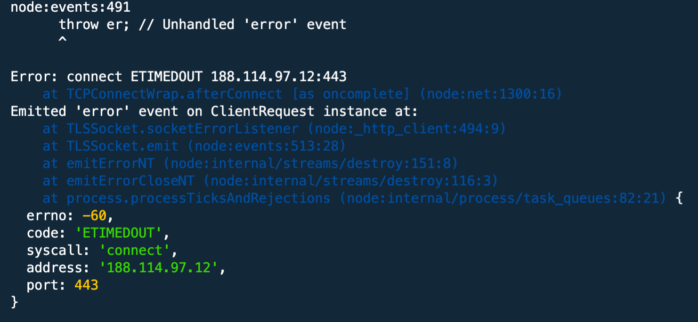

# Node.js Meme Scraper

Scrape the first 10 images from https://memegen-link-examples-upleveled.netlify.app/ and save it to the `memes` folder.

## How to run this precious little thing

to get the meme images from the website, write the following on the command line

`node index.js`

## Error handling

At one point in the programm, you might run into an error related to the node:events:491

According to the most trusted source in the world wide web, you can ignore this error

_Since this error is caused by the wish of a client, they don't expect to recieve any error message. So, no need to consider this error as critical. Just ignore it._

https://stackoverflow.com/questions/16995184/nodejs-what-does-socket-hang-up-actually-mean
